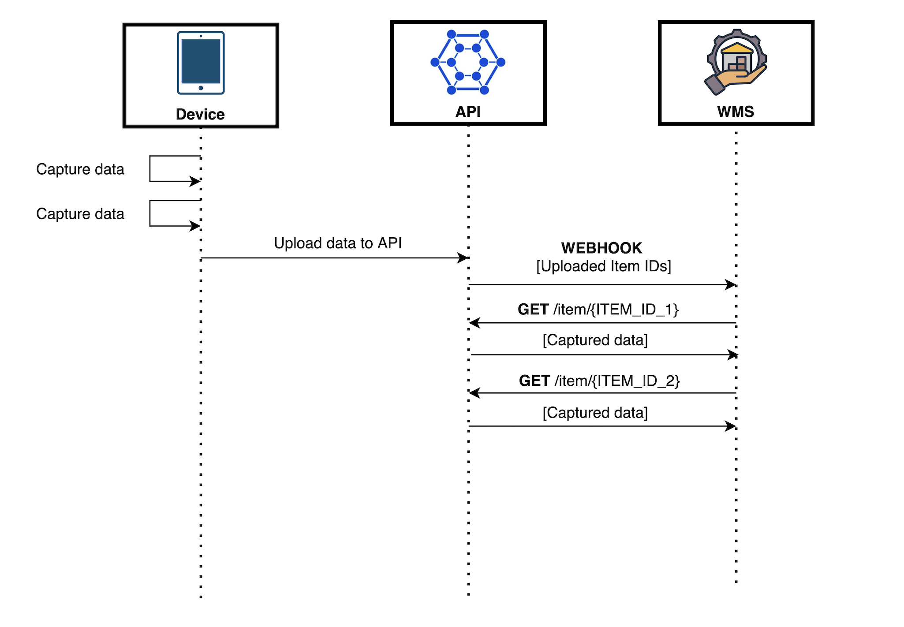
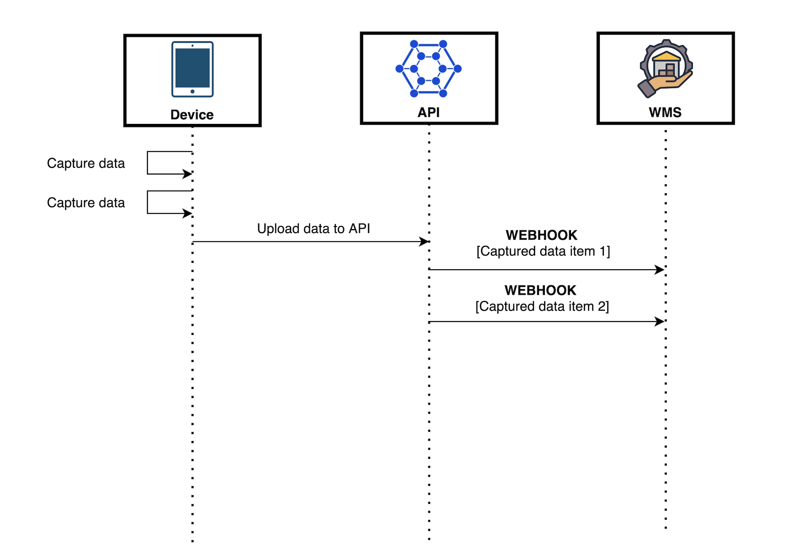

<br/><br/><p align="center">
  
</p><br/><br/>

# Introduction to Dimmy Webhooks
Webhooks allow services to notify each other of events. At their core, they are simply `POST` requests sent to a pre-determined endpoint. You can define your own endpoints in our web application and configure different endpoints for various combinations of *event types*. 

Dimmy supports the following event types:

- **`items.scanned`**: Triggered when the device uploads one or more flow results to our API. These messages include the `ID` of the completed request, which can be used to fetch further details from our [REST API](https://dimmy.api.optioryx.com).
<br/><br/><p align="center">
  
</p>

- **`item.scanned.full_payload`**: This event is triggered for every completed flow **seperately**. Instead of only containing the IDs for the scanned items, the payload of this event corresponds to the full response that would be obtained via a GET call to our [REST API](https://dimmy.api.optioryx.com). Note that this event type is NOT recommended for long flows as it might fail when payloads get too largep.

<br/><br/><p align="center">
  
</p>

This minimal Flask application serves as an illustration of what your webhook endpoint has to do. For incoming `items.scanned` events, this app verifies the payload using the request headers and your endpoint ***secret***. We also illustrate how you can use the webhook's item IDs to gather information about the incoming scanned objects using the Dimmy API.

Webhook signatures are a way to verify that webhook messages are sent by us. For a more detailed explanation, check out this article on [why you should verify webhooks](https://docs.svix.com/receiving/verifying-payloads/why). For more instructions and examples of how to verify signatures in different languages, check out Svix' [webhook verification documentation](https://docs.svix.com/receiving/verifying-payloads/how).

## Setting up webhooks 
To set up webhooks, you will need to navigate to the ***Webhook Dashboard***, which is accessible through ***Account & Limits*** in the [Dimmy Webapp](https://dimmy.app.optioryx.com/settings/account).


In the webhooks dashboard, you will be greeted with the endpoints page.


Click the "Add Endpoint" button to create a new endpoint. For production, you should deploy your endpoint to a domain or IP accessible by our [webhook workers](#ip-whitelist). For debugging, you can use the [Svix CLI](https://github.com/svix/svix-cli?tab=readme-ov-file#installation) to forward a temporary "playground" endpoint to your localhost. 

After installing the CLI, we start our Flask application:
```
python main.py
``` 
Assuming our application is running on `http://127.0.0.1:5000` (should be visible in the output of the above command) and your webhook endpoint lives at `/webhook` (which is the case in this example), we can run 
```
svix listen http://127.0.0.1:5000/webhook
```
From the output of this command, we can find a webhook URL that will redirect any callbacks to our local machine.


In the "Add Endpoint" screen that we navigated to earlier, we can now fill in the relay URL and select the event types that we will be listening to (in this case `items.scanned`).


After creating the endpoint, we can reveal the signing secret used to verify that this call actually originates from our servers. The variable `secret` in `main.py` should be equal to this text (don't forget to restart your Flask app after any changes).


## Setting up the REST API
Your app is now ready to receive events that contain the unique IDs of objects that were just scanned. To reveal all information that was collected, we need to use this ID and a secret API key to query the [Dimmy API](https://dimmy.api.optioryx.com).

To create an API key, you will again need to navigate to the ***Account & Limits*** page in the [Dimmy Webapp](https://dimmy.app.optioryx.com/settings/account) and look for the "New API Key" button. The variable `dimmy_api_key` in `main.py` should be set to your API key (don't forget to restart your Flask app after any changes).


## Trying it out
Once `main.py` contains all necessary tokens, you're ready to receive events! Try to scan an object using the iOS app with an active internet connection and observe your Flask console's output. You should see the data you've just scanned in the JSON format specified by our [API docs](https://docs.optioryx.com/docs/dimmy-api/latest/get-items-items-get). 

On the webhook dashboard page for your endpoint, you should also see a log of requests. This allows for manual replay ([although requests are also retried automatically at various time intervals](https://docs.optioryx.com/dimmy-webhooks)). To test this out, you could try to intentionally add a fatal error to your endpoint in `main.py`, scan an object, fix the error and click replay in the dashboard. The event system will only mark an event as handled if your endpoint responds with a `20X` response code.


## Retries
Svix attempts to deliver each webhook message based on a retry schedule with exponential backoff.

### The schedule
Each message is attempted based on the following schedule, where each period is started following the failure of the preceding attempt:

-   Immediately
-   5 seconds
-   5 minutes
-   30 minutes
-   2 hours
-   5 hours
-   10 hours
-   10 hours (in addition to the previous)

If an endpoint is removed or disabled delivery attempts to the endpoint will be disabled as well.

For example, an attempt that fails three times before eventually succeeding will be delivered roughly 35 minutes and 5 seconds following the first attempt.

### Manual retries
You can also use the application portal to manually retry each message at any time, or automatically retry ("Recover") all failed messages starting from a given date. To test out manual retries, introduce an intentional fatal error in `main.py`, start an optimization, fix the error, and replay the event via the dashboard. The system marks an event as handled only if your endpoint responds with a `20X` status code.

## Troubleshooting Tips
There are some common reasons why your webhook endpoint is failing:

### Not using the raw payload body
This is the most common issue. When generating the signed content, we use the raw string body of the message payload.

If you convert JSON payloads into strings using methods like stringify, different implementations may produce different string representations of the JSON object, which can lead to discrepancies when verifying the signature. It's crucial to verify the payload exactly as it was sent, byte-for-byte or string-for-string, to ensure accurate verification.

### Missing the secret key
From time to time we see people simple using the wrong secret key. Remember that keys are unique to endpoints.

### Sending the wrong response codes
When we receive a response with a 2xx status code, we interpret that as a successful delivery even if you indicate a failure in the response payload. Make sure to use the right response status codes so we know when message are supposed to succeed vs fail.

### Responses timing out
We will consider any message that fails to send a response within 20s a failed message. If your endpoint is also processing complicated workflows, it may timeout and result in failed messages.

We suggest having your endpoint simply receive the message and add it to a queue to be processed asynchronously so you can respond promptly and avoiding getting timed out.

## Failure Recovery

### Re-enable a disabled endpoint
If all attempts to a specific endpoint fail for a period of 5 days, the endpoint will be disabled. To re-enable a disabled endpoint, go to the webhook dashboard, find the endpoint from the list and select "Enable Endpoint".

### Recovering/Resending failed messages

#### Why Replay

-   If your service has downtime
-   If your endpoint was misconfigured

If you want to replay a single event, you can find the message from the UI and click the options menu next to any of the attempts.


From there, click "resend" to have the same message send to your endpoint again.

If you need to recover from a service outage and want to replay all the events since a given time, you can do so from the Endpoint page. On an endpoint's details page, click  `Options > Recover Failed Messages`.


From there, you can choose a time window to recover from.

For a more granular recovery - for example, if you know the exact timestamp that you want to recover from - you can click the options menu on any message from the endpoint page. From there, you can click "Replay..." and choose to "Replay all failed messages since this time."

## IP Whitelist
In case your webhook receiving endpoint is behind a firewall or NAT, you may need to allow traffic from [Svix's IP addresses](https://docs.svix.com/receiving/source-ips).

This is the full list of IP addresses that webhooks may originate from grouped by the region of the sender:

### US

```
44.228.126.217
50.112.21.217
52.24.126.164
54.148.139.208
```

### EU

```
52.215.16.239
54.216.8.72
63.33.109.123
```